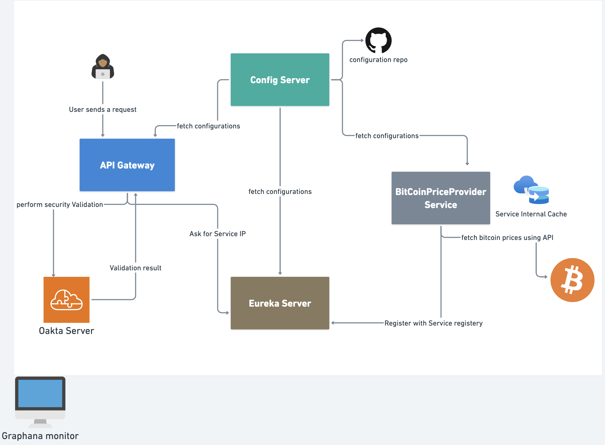
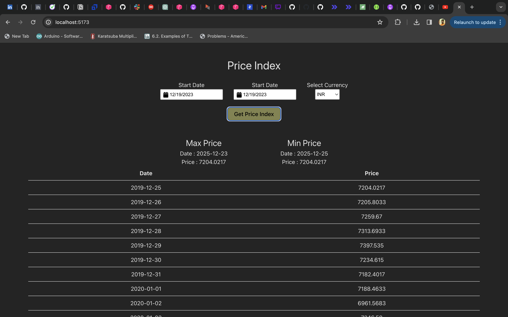
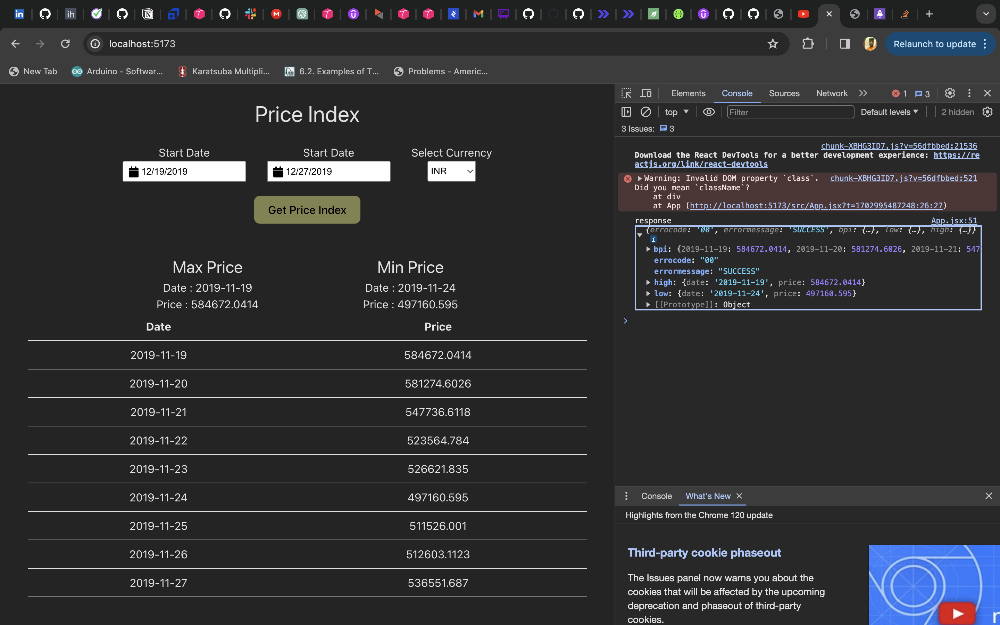

# BitCoin Historic Price Provider

# 1. Introduction

### 1.1 Object of this document

The Bitcoin Historic Service Provider is a service designed to provide historical Bitcoin Price Index (BPI) data. It offers a set of API endpoints that allow users to retrieve Bitcoin prices for specific date ranges, supported currencies, and more.

### 1.2 Tech-stack used

**Backend:**

- `Java 17`
- `Spring Boot 3.2`
- `Spring Cloud config`
- `Spring Cloud gateway`
- `Spring Cloud bus`
- `Maven build tool`

**Frontend:**

- `React`

**Testing:**

- `Unit Testing`
- `Integration Testing`

**Deployment:**

- `Docker`
- `Docker Hub`
- `Git`

**Monitoring & Logging:**

- `Grafana`
- `Prometheus`

### 1.3 CICD (Build and Deployment)
Repositories on github are configured with the github workflow
(actions) and whenever any commit is getting pushed to any particular repo
it will trigger the build (build and the docker image and publish it to dockerhub)

## 2. ****Architecture Overview****

The microservice application follows a microservices architecture pattern and utilizes various technologies and frameworks to facilitate its functionality.In the below diagram 
we can find the complete architecture of the application



## Architectural Flow
1. The Config Server loads configurations from the Git repository.
2. Eureka Server (Service Registry) registers microservices, enabling them to discover each other.
3. The Gateway Server registers with Eureka Server.
4. Microservices (e.g., bitcoin-historic-api-provider) register with Eureka Server.
5. All services fetch their configurations from the Config Server.
6. User requests, handled by the Gateway, are authenticated with an Okta server.
7. The Gateway retrieves service details from Eureka Server and forwards requests to the appropriate microservice.

## Sequential Diagram


The key components of the application are as follows:

### 2.1 BitCoin Historic Price Provider Service

   ## 2.4.1 **Functional Requirements**

   ### **Overview**

   The Bitcoin Historic Service Provider microservice is responsible for providing historic bitcoin prices for a provided time range and currency. It retrieves historic data from the BitCoin third party API and includes additional conditions and alerts based on certain criteria. The service should be accessible via web browsers or Postman using JavaScript frameworks, HTML, or JSON.

   ### **Input Parameters**

   The microservice accepts the following input parameters:

 - **`startDate`**: starting date from which user want to see the prices
  - **`endDate`**: end date till user want to see the prices
  - **`currency`**: currency / by default USD will be considered

   ### **Output**

   The microservice returns the following information for the provided dates and currency:

    - High and Low Price between the range.
    - List of Prices for the selected range of dates
      
   Example:

      ### **API Request to gateway server**

      POST `/bitcoin-historic-price-provider/retrieve-bitcoin-price-indices`
    
      API Request for bitcoin historic price provider service
```json
    {
      "startDate":"2019-12-25",
      "endDate":"2020-01-10",
      "currency":"INR"
    }
```

      API Response from bitcoin historic price provider

```json
        {
            "errocode": "00",
            "errormessage": "SUCCESS",
            "bpi": {
                "2019-12-25": 513189.3178,
                "2019-12-26": 513743.5059,
                "2019-12-27": 518540.0637,
                "2019-12-28": 522398.8128,
                "2019-12-29": 528417.949,
                "2019-12-30": 515911.2512,
                "2019-12-31": 511738.9423,
                "2020-01-01": 512478.1141,
                "2020-01-02": 496657.4303,
                "2020-01-03": 527197.9391,
                "2020-01-04": 527863.5224,
                "2020-01-05": 527915.7708,
                "2020-01-06": 557268.8578,
                "2020-01-07": 587093.7054,
                "2020-01-08": 574598.1677,
                "2020-01-09": 556547.7394,
                "2020-01-10": 581364.0895
            },
            "low": {
                "date": "2020-01-02",
                "price": 496657.4303
            },
            "high": {
                "date": "2020-01-07",
                "price": 587093.7054
            }
       }
   ```

### Cache:

The internal cache in this microservices architecture plays a pivotal role in enhancing efficiency 
and resilience. By storing date ranges, it acts as a safeguard during third-party API downtimes, preventing service disruptions. Furthermore, the cache optimizes performance by minimizing redundant calls to the API. It intelligently retrieves data for a partial date range from its store, seamlessly complementing it with real-time information fetched from the API for the remaining dates. This approach not only ensures continuous service availability but also significantly improves response times, offering a more responsive user experience.


## 2.4.2 Non-**Functional Requirements**

### 2.4.2.1 Monitoring

Monitoring is a critical aspect of any software system as it ensures the system's availability, performance, and reliability. Grafana and Prometheus are popular tools used for monitoring and visualizing system metrics and performance data.

- **Grafana:**

Grafana can pull data from various data sources like Prometheus and offers a rich UI where you can build up custom graphs quickly and create a dashboard out of many graphs in no time. It also allows you to set rule-based alerts, for notifications.

- **Prometheus:**

It is a time-series database that stores our metric data by pulling it (using a built-in data scraper) periodically over HTTP. It also has a simple user interface where we can visualize/query all of the collected metrics.

- **Actuator**

### 2.2 Spring Cloud Gateway Server
- The Gateway Server acts as the entry point for requests and routes them to the appropriate microservices.
- Implementation: Utilizes Spring Cloud Gateway for routing and handling requests.

### 2.3 Eureka Server
- The Eureka Server provides a service registry to manage and register microservices.
- Implemented using Spring Cloud Eureka for service registration and discovery.

### 2.4 ****Spring Cloud Config Server**** (Configuration Management)

Spring Cloud Config provides server and client-side support for externalized configuration in a distributed system. With the Config Server, you have a central place to manage external properties for applications across all environments.

1. **Centralized Configuration**: Spring Cloud Config Server allows you to externalize configuration properties from your microservices into a centralized server. This enables you to manage and update configuration settings without the need to modify or redeploy individual microservices.
2. **Dynamic Configuration Updates**: Config Server supports dynamic configuration updates, allowing you to change configuration properties at runtime without restarting the microservices. Microservices can fetch updated configuration settings from the Config Server periodically or on demand.
3. **Version Control**: Config Server integrates with version control systems, such as Git, allowing you to manage configuration properties as versioned artifacts. This facilitates change tracking, rollback, and collaboration in configuration management.


## 4. Frontend

Frontend is created on react. It calls the gateway URL with the required parameters.
#### Request
[`](http://localhost:8073/bitcoin-historic-price-provider/retrieve-bitcoin-price-indices)

{
  "startDate": "yyyy-mm-dd",
  "endDate": "yyyy-mm-dd",
  "currency": "USD"
}


Below are some screenshots of the frontend application





